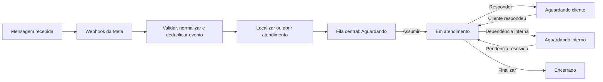
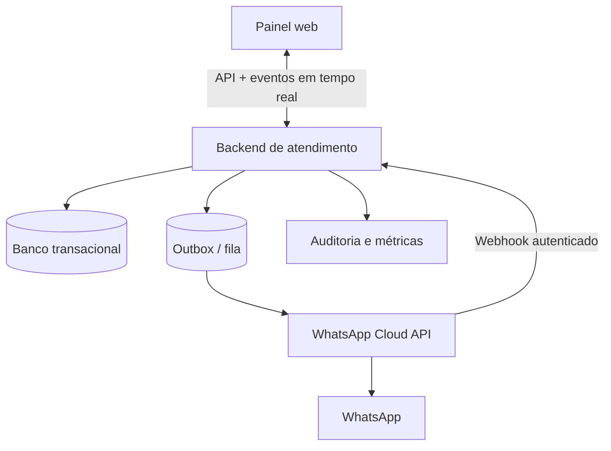

# Planejamento — Atendimento compartilhado inspirado na Blip

## 1. Direção recomendada

Começar por uma operação centralizada é o melhor recorte para o MVP.

Em vez de criar vários painéis isolados, criar um único **workspace de atendimento** com visões por status, filtros e contadores. A primeira operação usa uma fila única; filas, equipes e regras de roteamento já existem no modelo de dados, mas ficam opcionais até a fase de “ilhas”.

Sequência recomendada:

1. Definir o domínio e os contratos de integração.
2. Entregar o painel centralizado com dados simulados ou uma API interna.
3. Integrar diretamente os Webhooks e a Cloud API da Meta.
4. Rodar um piloto, observar a operação e estabilizar concorrência, SLA e auditoria.
5. Introduzir ilhas, filas especializadas e roteamento progressivamente.

Essa ordem valida primeiro a rotina do atendente e reduz o risco de automatizar uma organização de filas ainda não testada.

## 2. Escopo do MVP centralizado

### Workspace do atendente

Uma tela principal com:

- lista de atendimentos, busca, filtros e contadores;
- visões por status;
- identificação do cliente e contexto mínimo necessário;
- histórico cronológico de mensagens e eventos;
- campo para resposta e envio de anexos previstos no escopo;
- ações de assumir, atribuir, transferir, alterar status e encerrar;
- atualização em tempo real quando outro atendente agir.

### Status iniciais

Manter poucos estados operacionais e separar o estado do atendimento de sua atribuição:

| Status | Significado | Responsável pela próxima ação |
|---|---|---|
| `AGUARDANDO` | Entrada recebida e ainda não assumida | Operação |
| `EM_ATENDIMENTO` | Atendimento assumido por um agente | Atendente |
| `AGUARDANDO_CLIENTE` | Resposta enviada; aguardando retorno | Cliente |
| `AGUARDANDO_INTERNO` | Depende de ação interna | Operação |
| `ENCERRADO` | Atendimento finalizado | Ninguém |

`NOVO` pode ser um marcador visual de mensagem não lida, em vez de um status adicional. Um atendimento reaberto volta para `AGUARDANDO` ou `EM_ATENDIMENTO` conforme a regra definida pelo negócio.

### Perfis iniciais

- **Atendente:** visualiza a fila permitida, assume e conduz atendimentos.
- **Supervisor:** visualiza todos, atribui/transfere, intervém e acompanha métricas.
- **Administrador:** configura integrações, usuários, permissões e parâmetros operacionais.

## 3. Conceitos de domínio

Não tratar “conversa” e “atendimento” como a mesma coisa:

- **Contato:** identidade da pessoa no canal.
- **Conversa:** fluxo contínuo de mensagens de um contato em um canal.
- **Atendimento:** unidade operacional com abertura, responsável, status, SLA e encerramento.
- **Mensagem:** conteúdo recebido ou enviado, com o identificador externo do provedor.
- **Atribuição:** vínculo atual e histórico entre atendimento, agente, equipe e fila.
- **Evento de atendimento:** registro imutável de mudança de status, atribuição, transferência e encerramento.

Entidades mínimas:

- `contacts` e `contact_channels`;
- `conversations`;
- `attendances`;
- `messages`;
- `assignments`;
- `attendance_events`;
- `agents` e `roles`;
- `queues` e `teams`, inicialmente com uma fila padrão;
- `integration_events` e `outbox_messages` para a integração confiável.

Campos como `queue_id` e `team_id` devem existir desde o início, mas podem apontar para uma única fila/equipe padrão no MVP.

## 4. Fluxo operacional inicial

## 5. Regra essencial do atendimento compartilhado

O ato de “assumir” precisa ser atômico. Se dois atendentes tentarem assumir o mesmo atendimento, apenas um pode vencer; o outro recebe a informação de que o item já foi atribuído.

Implementação recomendada:

- atualização condicional no banco, usando versão do registro ou condição `assignee_id IS NULL`;
- resposta de conflito quando a versão estiver desatualizada;
- evento em tempo real para remover ou atualizar o atendimento nas telas dos demais agentes;
- histórico de atribuições e transferências, sem sobrescrever a auditoria anterior;
- política explícita para supervisor forçar transferência.

No MVP, evitar coedição simultânea de um mesmo atendimento. A equipe pode enxergar o item, mas somente o agente responsável envia mensagens, salvo intervenção auditada do supervisor.

## 6. Integração direta com a Meta

Criar uma camada de adaptação para que o domínio não dependa do formato específico do provedor.

### Entrada no sistema

O adaptador interno converte o payload nativo da Meta para eventos do domínio contendo, no mínimo:

- identificador único do evento;
- identificador externo da mensagem;
- canal e conta/número de origem;
- identificador do contato;
- data/hora do evento no provedor;
- tipo e conteúdo da mensagem;
- referência de mídia, quando aplicável;
- referência à mensagem respondida, quando aplicável;
- status de entrega/leitura, quando aplicável.

Requisitos:

- autenticar e validar a origem do webhook;
- responder rapidamente e processar de forma assíncrona;
- garantir idempotência por identificador externo;
- tolerar eventos duplicados e fora de ordem;
- preservar o payload bruto em área restrita somente quando necessário para suporte/auditoria;
- ter fila de erro e mecanismo de reprocessamento.

### Saída do sistema

O backend registra a mensagem a enviar e publica uma solicitação para a WhatsApp Cloud API por meio do padrão outbox.

Estados técnicos sugeridos: `PENDENTE`, `ACEITA_PELO_PROVEDOR`, `ENTREGUE`, `LIDA` e `FALHA`.

O adaptador da Meta concentra payloads, autenticação, regras da janela de atendimento, templates e tradução de erros. O domínio recebe estados e motivos legíveis sem espalhar particularidades da Graph API.

## 7. Arquitetura lógica

Responsabilidades:

- **Painel:** operação, filtros, timeline e feedback imediato de conflitos.
- **Backend:** regras de atendimento, autorização, atribuição atômica e consistência.
- **Banco:** estado atual e histórico auditável.
- **Fila/outbox:** entrega confiável, retentativas e desacoplamento.
- **Adaptador Meta:** tradução do contrato nativo, credenciais do canal e regras específicas do provedor.
- **Canal em tempo real:** alterações de status, novas mensagens, atribuições e contadores.

## 8. Roadmap por fases

### Fase 0 — Descoberta e contrato

Objetivo: fechar decisões que influenciam o domínio e a integração.

Entregáveis:

- mapa do processo atual e principais exceções;
- definição de abertura, reabertura e encerramento de atendimento;
- matriz de papéis e permissões;
- contrato dos Webhooks e da Cloud API da Meta;
- política de anexos, retenção e acesso a dados;
- wireframe do workspace centralizado;
- métricas de sucesso do piloto.

Gate de saída: eventos de entrada/saída, estados e regras de atribuição aprovados.

### Fase 1 — Núcleo e painel centralizado

Objetivo: validar a operação compartilhada antes da integração real.

Entregáveis:

- autenticação e autorização;
- fila única e visões por status;
- timeline de mensagens/eventos;
- assumir, atribuir, transferir e encerrar;
- controle atômico de atribuição;
- atualização em tempo real;
- busca e filtros essenciais;
- trilha de auditoria;
- simulador/adaptador falso de mensagens para testes.

Gate de saída: fluxo completo testável sem WhatsApp real, incluindo disputa entre dois atendentes.

### Fase 2 — Integração WhatsApp

Objetivo: operar o mesmo fluxo com mensagens reais diretamente pela Meta.

Entregáveis:

- webhook autenticado e idempotente;
- adaptador de entrada e saída;
- envio confiável com outbox e retentativas;
- status de entrega e falhas;
- suporte aos tipos de mídia priorizados;
- reprocessamento e observabilidade da integração;
- homologação ponta a ponta.

Gate de saída: mensagem recebida aparece uma única vez e resposta enviada possui rastreabilidade ponta a ponta.

### Fase 3 — Piloto e endurecimento operacional

Objetivo: validar o comportamento em uso real controlado.

Entregáveis:

- piloto com grupo pequeno de atendentes;
- dashboards de volume, fila, tempo de primeira resposta e tempo de resolução;
- alertas de falha e backlog;
- revisão de permissões, logs e retenção;
- testes de carga e recuperação;
- ajustes de UX e processo com base em telemetria e entrevistas.

Gate de saída: metas do piloto atendidas e operação estável por período acordado.

### Fase 4 — Ilhas e filas especializadas

Objetivo: segmentar a operação sem perder a visão supervisora global.

Entregáveis:

- cadastro de equipes/ilhas e filas;
- associação de agentes a uma ou mais equipes;
- transferência entre ilhas;
- visões por equipe e visão global para supervisão;
- capacidade e horários por ilha;
- fallback para a fila central quando não houver rota válida.

Começar com roteamento manual ou regras simples e transparentes. Exemplos: número de entrada, assunto escolhido, carteira ou horário. Roteamento por capacidade, prioridade e habilidades deve ser uma evolução posterior, baseada em dados do piloto.

### Fase 5 — Automação e otimização

Possíveis evoluções:

- distribuição automática por capacidade e habilidades;
- prioridades e SLA por tipo de atendimento;
- respostas rápidas e templates governados;
- tags e motivos de encerramento;
- bot de triagem com transferência contextual para humano;
- pesquisa de satisfação;
- qualidade, amostragem e avaliação de atendimentos;
- integrações com CRM e sistemas internos.

## 9. Backlog inicial priorizado

### P0 — necessário para o MVP

- domínio de conversa, atendimento, mensagem e atribuição;
- login, perfis e escopo de acesso;
- painel central com filtros por status;
- assumir atendimento com proteção de concorrência;
- timeline e envio de texto;
- mudança de status, transferência e encerramento;
- eventos em tempo real;
- auditoria de ações humanas e técnicas;
- webhook idempotente;
- outbox, retentativas e monitoramento de falhas;
- proteção de dados e logs sem conteúdo sensível desnecessário.

### P1 — piloto

- anexos prioritários (pendente — decidido como requisito na seção 13, implementação ainda não iniciada);
- ✅ busca por contato e protocolo;
- ✅ tags do atendimento (motivo de encerramento já existia via `ClosureReason`);
- ✅ respostas rápidas;
- ✅ métricas operacionais (já existiam antes desta rodada);
- ✅ reprocessamento assistido;
- ✅ regra de inatividade (reabertura automática descartada — ver decisão 1 da seção 13);
- ✅ notificações de novos atendimentos e mensagens (toast + Notification API, só no navegador aberto).

### P2 — pós-validação

- múltiplas ilhas/filas;
- regras de roteamento;
- balanceamento automático;
- SLA avançado;
- bot de triagem;
- integrações adicionais.

## 10. Critérios de aceite críticos

1. Duas tentativas simultâneas de assumir o mesmo atendimento resultam em um único responsável.
2. A mesma mensagem da Meta, recebida repetidamente, gera uma única mensagem.
3. Nenhuma resposta ao cliente é perdida após uma falha temporária da Graph API.
4. Toda mudança de responsável e status registra autor, data/hora, origem e estado anterior/novo.
5. Uma nova mensagem atualiza lista, timeline e contadores dos usuários autorizados em tempo real.
6. Falhas de envio ficam visíveis e podem ser reprocessadas com segurança.
7. Usuários não acessam atendimentos fora de seu escopo de permissão.
8. Conteúdo de mensagens e dados pessoais não aparecem desnecessariamente em logs técnicos.
9. O supervisor consegue localizar um atendimento por contato, protocolo ou identificador externo permitido.
10. A futura ativação de uma segunda fila não exige migração estrutural do núcleo de atendimento.

## 11. Métricas do piloto

- volume recebido, iniciado e encerrado;
- tamanho e idade da fila;
- tempo até primeira resposta humana;
- tempo total de atendimento;
- tempo em cada status;
- taxa de transferência e reabertura;
- mensagens com falha e tempo de recuperação;
- atendimentos abandonados ou parados;
- distribuição de carga por atendente;
- satisfação, caso a pesquisa esteja no escopo.

Definir metas somente após coletar uma linha de base; evitar usar uma meta arbitrária para automatizar roteamento cedo demais.

## 12. Segurança, privacidade e LGPD

- coletar e exibir somente os dados necessários ao atendimento;
- controle de acesso por papel e, futuramente, por equipe/fila;
- trilha de auditoria para leitura e alteração de dados sensíveis quando aplicável;
- criptografia em trânsito e em repouso conforme a infraestrutura disponível;
- segredos fora do código e com rotação;
- mascaramento de telefone e outros identificadores em logs e telas sem necessidade operacional;
- política de retenção, descarte e atendimento a solicitações de titulares;
- restrição e expiração de URLs de mídia;
- ambientes não produtivos sem dados reais, ou com dados anonimizados;
- plano de resposta a incidentes e revisão periódica de acessos.

## 13. Decisões fechadas (2026-09-21)

1. **Abertura/reabertura:** mantém o comportamento atual do código. Mensagem sem atendimento ativo abre um atendimento novo; atendimento `ENCERRADO` nunca reabre sozinho — não existe janela de tempo de reabertura automática.
2. **Atendimentos simultâneos por atendente:** sem limite por enquanto. Definir meta só depois de coletar linha de base no piloto (seção 11).
3. **Supervisor sem assumir:** mantém como hoje — `SUPERVISOR`/`ADMIN` podem enviar mensagem sem `claim`, fica registrado via `actor_id` no evento. Nenhum campo extra de “intervenção”.
4. **Mídia no MVP:** entram imagem e documento (PDF). Passa a ser item de escopo ativo, fora dos backlog P1 abaixo — ver observação no fim desta seção.
5. **Templates/janela de 24h da Meta:** não entram no piloto. Só texto livre dentro da janela padrão; fora da janela, mensagem falha e fica visível como falha, sem reabertura automática via template.
6. **Multi-organização:** uma única operação (EVIG), sem isolamento multi-tenant. Não existe `organization_id` no schema e não entra agora.
7. **Definição de “ilha”:** combinação de equipe e assunto/departamento.
8. **Dados do cliente no painel:** só os que já existem — nome, telefone, tags, notas internas. Sem integração com CRM externo por enquanto.
9. **Retenção/auditoria:** sem política formal ainda; mantém tudo indefinidamente em ambiente de desenvolvimento. Vira pendência obrigatória antes de operar com dado real de titular em produção.
10. **Volume esperado:** desconhecido — medir no piloto antes de fixar meta (segue a mesma lógica da seção 11).

**Observação sobre a decisão 4:** ao contrário das demais, essa decisão expande escopo (mídia estava fora do MVP). Fica registrado aqui que passou a ser requisito ativo; a implementação (upload, storage, envio/recebimento via Graph API, UI de anexo) ainda precisa ser planejada e priorizada separadamente do backlog P1 da seção 9.

## 14. Primeira entrega sugerida

Uma fatia vertical pequena, demonstrável e segura:

> Receber uma mensagem simulada, criar um atendimento em `AGUARDANDO`, permitir que apenas um de dois atendentes o assuma, trocar mensagens, colocar em `AGUARDANDO_CLIENTE`, receber nova mensagem, retomar e encerrar — com atualização em tempo real e auditoria de todas as transições.

Depois dessa fatia passar pelos critérios de aceite, ativar o adaptador direto da Meta sem alterar o fluxo operacional do painel.
